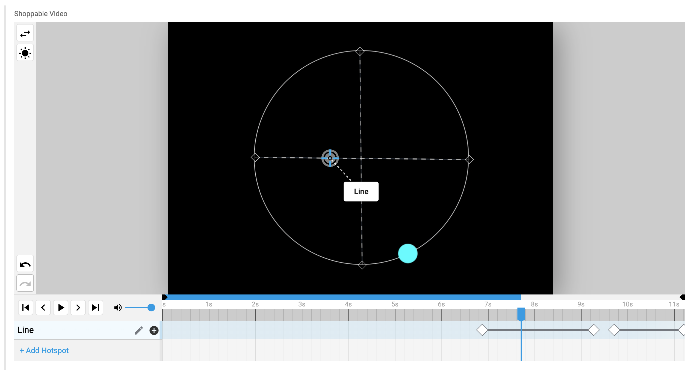
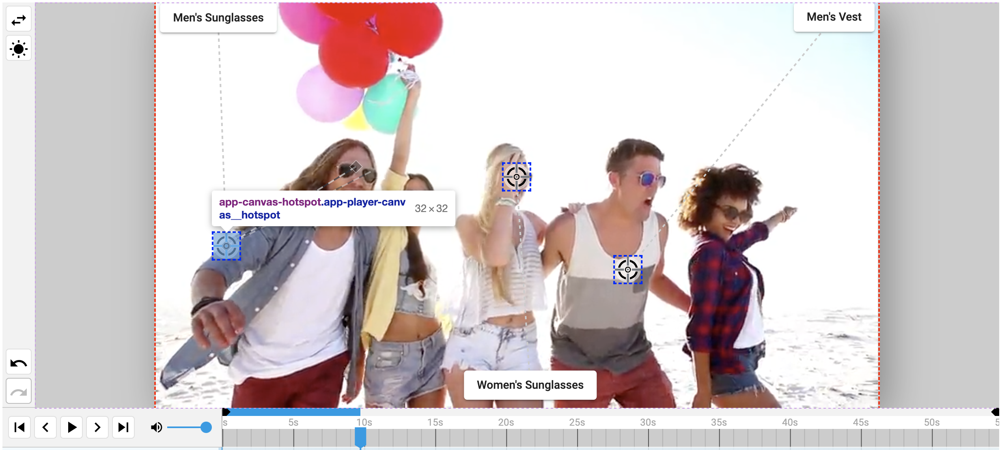

# Format & Usage information

The Shoppable Video data format is rather simple in structure, but may need some additional explanation to fully understand and use. Using the tool yourself should be enough to help you form a basic understanding of how hotspots are created, and keyframes are placed within them. The main technical challenge is how these lists of keyframe objects are interpreted and drawn over a video, which this document should explain.

## Example



In the example video above, a single hotspot called "Line" has been created, which moves from left to right (with a CTA below), disappears for a short time, then re-appears at the top and moves to the bottom (with a CTA to the right). Four keyframes are placed to achieve this, where the time between the 2nd and 3rd keyframes has the hotspot invisible as it prepares for the vertical motion.

Here is the JSON for this Shoppable Video:

```json
{
  "shoppableVideo": {
    "video": {
      "_meta": {
        "schema": "http://bigcontent.io/cms/schema/v1/core#/definitions/video-link"
      },
      "id": "f1d0b86f-e145-42e1-ab5f-88d200900456",
      "name": "Circle Video",
      "endpoint": "csdemo",
      "defaultHost": "cdn.media.amplience.net"
    },
    "hotspots":[
      {
        "target": "Line",
        "selector": ".line",
        "timeline": {
          "points": [
            {
              "t": 6.878251856629596,
              "p": {
                "x": 0.2273031496062992,
                "y": 0.4973125
              },
              "cta": {
                "x": 0.5019163789523866,
                "y": 0.6225831298828124
              }
            },
            {
              "t": 9.271823318730846,
              "p": {
                "x": 0.7827386811023621,
                "y": 0.50509375
              },
              "e":true
            },
            {
              "t": 9.71406858138698,
              "p": {
                "x": 0.4987962521530511,
                "y": 0.10833935546875
              },
              "cta": {
                "x": 0.6270718503937007,
                "y": 0.4860003662109375
              }
            },
            {
              "t": 11.206391891411474,
              "p": {
                "x": 0.5045337106299211,
                "y": 0.891921875
              },
              "e": true 
            }
          ]
        },
        "cta":{
          "caption": "Line",
          "value": "https://amplience.com"
        }
      }
    ]
  }
}
```

The `video` field is a normal amplience media link. You can use the provided information to request video metadata, which will give you links to your transcoded videos which you can provide to your video player. You can find more information [here.](https://amplience.com/docs/contenthub/videotranscodeprofiles.html)

The `hotspots` field is an array of hotspot objects, where each represents a hotspot created in the editor. All hotspots have a string `target` and `selector`, and a `timeline` object. A hotspot optionally has a `cta` field, which contains the CTA `caption` and `value`. These fields can all be configured by using the "Edit hotspot info" button in the editor.

The `timeline` object contains a `points` array, which contains keyframes representing the hotspot's location as it changes through time. Keyframe fields are as follows:

- `t`: This is the time in seconds where this keyframe has been placed.
- `p`: This is the position of the hotspot when placed. `p.x` and `p.y` contain normalized x and y positions from 0 to 1.
- `e`: This indicates that the hotspot's visibility ends after this keyframe, until the next keyframe where `e` is `false`. If this is not present, assume the value is false.
- `cta`: This is the centre position of the CTA button. This only appears at the start of the video, or after a keyframe with `e` as true. `cta.x` and `cta.y` contain normalized x and y positions from 0 to 1.

Note that all (x, y) positions in the format are normalized; varying from 0 to 1. The (0, 0) coordinate is at the top left of the video, while the (1, 1) coordinate is at the bottom left. X and Y are horizontal and vertical coordinates, as you might expect. When using these coordinates for placing elements over a video, you should scale them using the video width and height to get their pixel position.

## Drawing Hotspots over a Video



The typical approach you might want to take is to place a canvas div on top of the video container. In the extension and visualization, this is a container div that fits the size of the player, which contains another canvas div which matches the size of the video, and is centered. Hotspots and the CTA are placed within this canvas div, with position transforms calculated by multiplying the normalized 0-1 positions by the canvas width and height.

In the example above, the outer container has a purple outline, the video sized canvas has a red one, and the hotspot elements placed using `transform` have a blue outline. The CTAs and lines to them are also placed with similar transforms within the canvas element.

It's recommended that you use a video player where the controls not overlap with the video, as the hotspots and CTAs will obstruct them. If this is unavoidable, then you should give your canvas and container elements the style `pointer-events: none;` and your CTAs within `pointer-events: auto;` to avoid the canvas fully blocking input on the controls.

### Keyframe Interpolation

In the data format, hotspot and CTA positions are marked over time as keyframes. Each keyframe has an associated time value, and you will notice the keyframes appear in ascending order based on their time. This time value is marked in seconds, and marks a moment where the positions must be in the specified location.

This keyframe data is sparse, so to get values between them you will have to *interpolate* their values. Right now, the editor assumes all keyframes use linear interpolation, so to match the editor you should implement this yourself.

Given two keyframes `p1` and `p2`, and an input time `t` between their times, you can calculate an interpolated position as follows:

```typescript
// Interpolation progress. 0 means fully p1, 1 means fully p2.
const i = (t - p1.t) / (p2.t - p1.t);
const mi = 1 - i;

// The result is the interpolation progress multiplied by the second point,
// added to the inverse interpolation progress multiplied by the first.
const pos = {
  x: p1.p.x * mi + p2.p.x * i,
  y: p1.p.y * mi + p2.p.y * i,
}
```

You should make sure that both points are the keyframes immediately before and after the target time. Note that times before the first keyframe and after the last should not draw hotspots.
